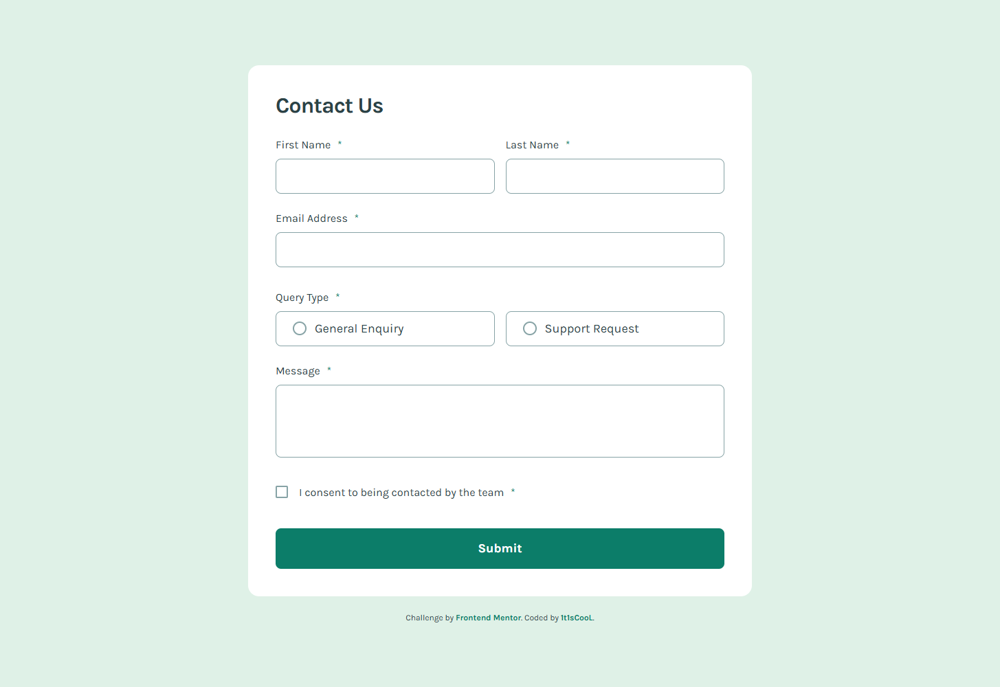
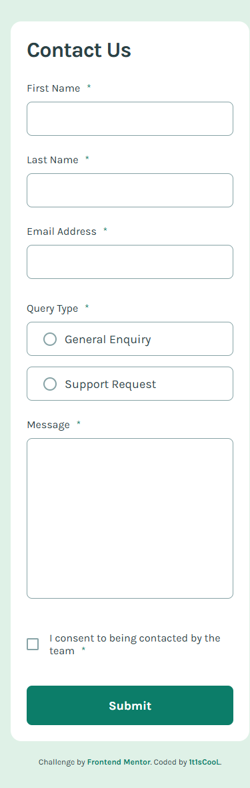

# Frontend Mentor - Contact form solution

This is a solution to the [Contact form challenge on Frontend Mentor](https://www.frontendmentor.io/challenges/contact-form--G-hYlqKJj). Frontend Mentor challenges help you improve your coding skills by building realistic projects.

## Table of contents

- [Overview](#overview)
    - [The challenge](#the-challenge)
    - [Screenshots](#screenshots)
    - [Links](#links)
- [My process](#my-process)
    - [Built with](#built-with)
    - [What I learned](#what-i-learned)
- [Development](#development)
- [Author](#author)

## Overview

### The challenge

Users should be able to:

- Complete the form and see a success toast message upon successful submission
- Receive form validation messages if:
    - A required field has been missed
    - The email address is not formatted correctly
- Complete the form only using their keyboard
- Have inputs, error messages, and the success message announced to assistive technology using ARIA
- View the optimal layout for the interface depending on their device's screen size (375px / 1440px designs)
- See hover, focus, and active states for all interactive elements on the page

### Screenshots

| Desktop                              | Mobile                             |
| ------------------------------------ | ---------------------------------- |
|  |  |

### Links

- Solution URL: [Vercel](https://contact-form-main-ruddy.vercel.app/)
- Live Site URL: [mmalabugin.ru/ContactForm](https://mmalabugin.ru/ContactForm/)

## My process

### Built with

- Semantic HTML5 markup (`<form>`, `<fieldset>`/`<legend>`, labelled inputs, `aria-invalid` / `aria-describedby` / `role="alert"`)
- CSS custom properties, Flexbox and CSS Grid
- [Qwik](https://qwik.dev/) 1.20 + TypeScript + [Vite](https://vite.dev/), running as a pure client-side (CSR) app (`qwikVite({ csr: true })` + `render()`) so it builds to plain static files
- Self-hosted Karla variable font with `font-display: optional` and a preload to avoid layout shift
- Pixel-perfect layout: the design JPGs were overlaid on the rendered page with `mix-blend-mode: difference`, and every anchor was measured programmatically (canvas pixel scans vs `getBoundingClientRect`) until deltas dropped to ~0 on both 1440px and 375px

### What I learned

- Qwik is SSR/resumability-first. In its CSR mode the fine-grained reactivity (`useStore`, `useSignal` → `value`/`checked`/`class` bindings) and `useVisibleTask$` work perfectly, but the lazy `$` **event** handlers (`onInput$`, `onChange$`, `onSubmit$`) do not attach. The form is therefore wired up with a single eager, delegated listener registered in `useVisibleTask$` (`input` / `change` / `submit` on the `<form>`); store mutations still drive all re-renders, so the UI stays fully reactive.
- That same eager listener is what reliably calls `preventDefault()` on submit — the declarative `preventdefault:submit` (a qwikloader feature) has no effect in CSR because the handler is lazy and the native submit fires first.
- Validation lives in a pure, module-level function so it serializes cleanly across Qwik's QRL boundaries; errors show on submit and then clear live as each field becomes valid.
- Custom radio/checkbox visuals: the native inputs are visually hidden but kept focusable; markers are drawn with CSS and the provided SVG icons, driven by the reactive `checked` state.

## Development

```bash
npm install
npm run dev       # http://localhost:5173
npm run build     # tsc && vite build → dist/ (static)
```

> Note: `npm run preview` (the Qwik preview server) currently crashes in CSR mode; serve the `dist/` folder with any static server instead.

Deploy convention: `main` targets Vercel (the `base` line in `vite.config.ts` stays commented). The `deploy` branch enables `base: '/ContactForm/'` and is built by Jenkins into a Docker image (nginx) deployed to Kubernetes behind the shared Traefik ingress (`ingresses` repo).

## Author

- Website - [mmalabugin.ru](https://mmalabugin.ru/)
- Frontend Mentor - [@1t1sCooL](https://www.frontendmentor.io/profile/1t1sCooL)
- Twitter - [@vi_el_mar](https://www.twitter.com/vi_el_mar)
- Telegram - [@ItIsCooL](https://t.me/ItIsCooL)
